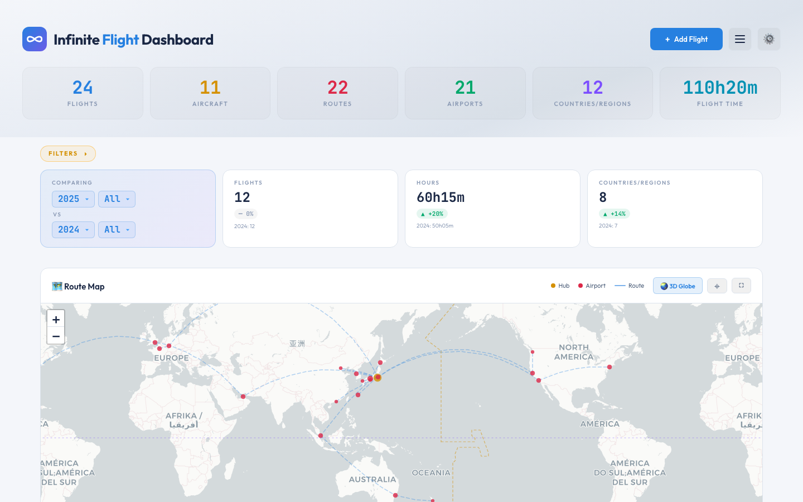
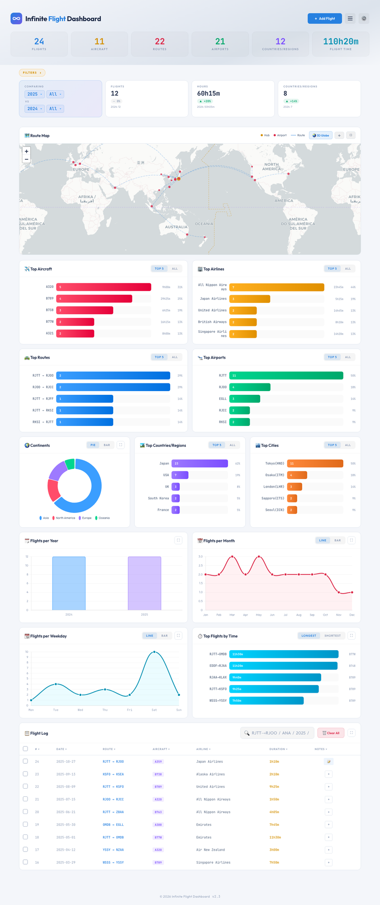
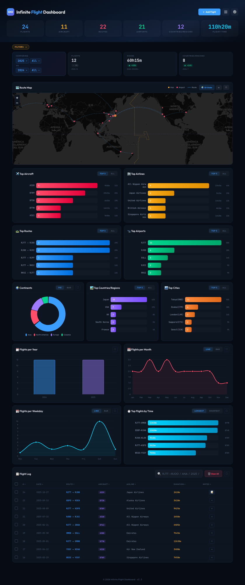
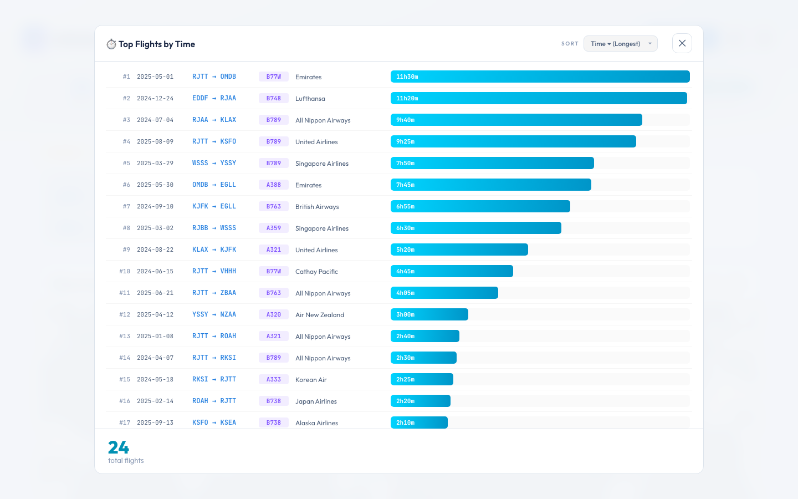
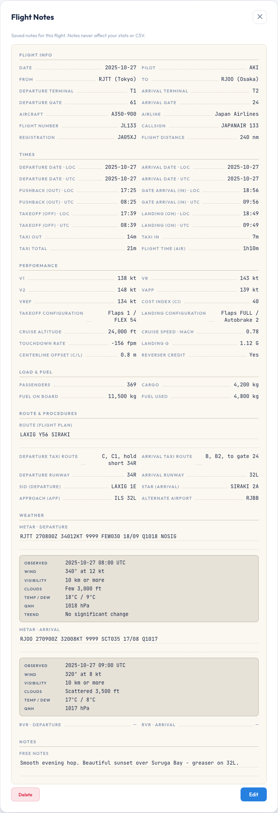
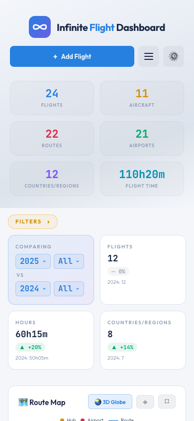
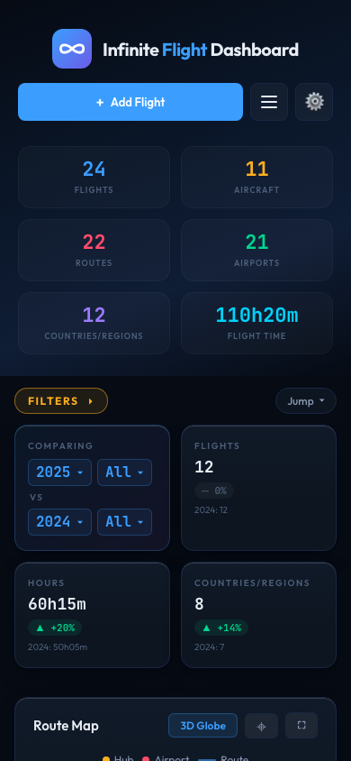

<div align="center">

# Infinite Flight Dashboard

**[Infinite Flight](https://infiniteflight.com) パイロットのための、フライトログダッシュボード。**

### → [**ダッシュボードを開く**](https://infinite-flight-dashboard.vercel.app) ←

`infinite-flight-dashboard.vercel.app`

[English](README.md) · [日本語](README.ja.md) · [简体中文](README.zh-CN.md) · [変更履歴](CHANGELOG.md) · [バグ報告](https://github.com/AKI-12138/Infinite-Flight-Dashboard/issues) · [アイデア・ご意見](https://github.com/AKI-12138/Infinite-Flight-Dashboard/discussions)



</div>

---

## これは何？

Infinite Flight のフライトログを、見やすいチャート、世界地図、3D 地球儀に変換するシンプルでプライベートなダッシュボードです。

「自分の旅路を*見える化*したい」IF パイロット向け。よく乗っている機材、行ったことのある路線、年ごとに増えた飛行時間 — 数字を視覚化します。

| ライトモード | ダークモード |
|---|---|
|  |  |

## できること

- **統計が一目で分かる** — トータルフライト数、飛行時間、機材数、訪問国数を画面上部にズラリと表示
- **あらゆる切り口でチャート化** — トップ機材・トップ航空会社・トップ路線・トップ空港・トップ国、それに加えて年別・月別・曜日別のフライト数。大陸カードは**円⇄棒**、月別・曜日別は**折れ線⇄棒**に切り替え可能（選択は記憶される）
- **世界地図でルート可視化** — 全フライトを大圏ルート（地球の最短距離）で描画。ハブ空港・通過空港もマーク
- **3D 地球儀でルートを回転** — 自動回転。ドラッグでじっくり見たり、回転を一時停止したりできる
- **強力なフィルター＋比較** — **カスタマイズ可能な**クイックバー（最大6チップを選択・既定は年・月・航空会社・機材・国・Scope）、それ以外は **⚙ 高度フィルター**パネルに集約：出発/到着の空港・都市・国・大陸、大陸内/大陸間、飛行時間（バケット or カスタム範囲）— 検索付きメニュー・ワンクリックの**プリセット**・自分で作る**保存プリセット**まで。チャートのバーをクリックして直接ドリルダウンも可能。前年比較も内蔵で「去年より飛行時間どれだけ伸びた？」が一目で
- **フライトごとの詳細メモ** — 統計に収まらない記録のための メモページを各フライトに用意。見た目は**紙のログ帳**そのもの：便名・コールサイン（自便のエアラインから入力候補を提案）・機体記号、OUT/OFF/ON/IN 時刻 — **現地時刻を入れれば UTC は空港のタイムゾーンから自動計算** — タキシー時間（合計は自動）、V スピード、離着陸の構成、巡航高度・マッハ、距離、搭載量・燃料、ルート、SID/STAR、滑走路、進入方式、代替空港、**METAR は自動で解読**、自由記述。日付・発着地・機材・航空会社はログから自動で埋まる。全項目任意入力・統計や CSV には一切影響しない。フライトログはメモの有無で並び替えも可能
- **記録し直さずに直せる** — 追加済みフライトの日付・ルート・機材・航空会社・飛行時間を、フライトログの鉛筆ボタンから編集。書いたメモはそのまま残る
- **簡単インポート** — フライトログをほぼどんなフォーマットでも貼り付け OK。日付・機材コード・航空会社名を自動で判定
- **フルバックアップ 1 ファイル** — フライト＋カスタム空港＋メモを 1 つの JSON に書き出し。別端末の Import に放り込めば丸ごと復元
- **内蔵の動作確認（Function-test）** — ⚙ 設定 → **Function-test** がブラウザ内でアプリの健全性（保存・データ整合性・ロジック）をチェックし、問題がある項目だけ表示。バグ報告リンク付き
- **数百の空港を内蔵** — 世界の主要空港は最初から登録済み。マイナーな空港に飛んだら手動追加も可能
- **データチェック** — ログ内の未収録の空港・機材（地図から漏れて国別カウントからも外れる）を洗い出し、未収録の空港はワンクリックで追加でき、任意の空港が収録されているかも検索できる
- **クイック検索** — `RJTT→KJFK B77W 2025` のようなシンプルな書き方で特定のフライトを即座に絞り込み
- **ライト/ダークテーマ** — どちらか選ぶか、スマホの設定に追従させるかが選べる
- **スマホ対応** — 同じダッシュボードがモバイルレイアウトで動く
- **リンクを開くだけで使える** — インストール不要、サインアップ不要、設定不要



## 使い始め方

モダンブラウザでこのリンクを開くだけ — インストール不要・サインアップ不要：

**→ [infinite-flight-dashboard.vercel.app](https://infinite-flight-dashboard.vercel.app)**

最初に開くと、ダッシュボードは空っぽで 2 つのボタンが表示されます — **Import CSV**（フライトログがある人）か **Add your first flight**（最初の 1 件から始める人）。以下のガイドで、入った後に何ができるかを順番に説明します。

> **ヒント:** スマホでは、ブラウザの共有メニューから「ホーム画面に追加」するとアプリのように使えます。

## 使い方

### ヘッダー

ヘッダーは主要ボタン 1 つ＋コンパクトなメニュー 2 つだけ：

- **+ Add Flight** — 主役のボタン（常に表示）
- **≡ メニュー** — Search flights（検索）・Data check（データチェック）・Import・Export・Clear all
- **⚙️ 設定** — テーマ（Auto / Light / Dark）・フィルターバーのカスタマイズ・Status（自動保存・データチェック・Function-test）

### CSV からフライトをインポート

ヘッダーの **≡ メニュー → Import**、または空状態の **Import CSV** をクリックし、ファイルを選択するか CSV を直接貼り付け。

**必要なフォーマット（6 列）:**

```
date,dep,arr,aircraft,airline,duration
2025-06-01,RJTT,RJOO,B772,ANA,1h15m
2025/6/2,rjoo,rjtt,a359,Japan Airlines,1:10
25-06-03,RJTT,RJCC,b77w,ANA,90m
```

**インポーターは寛容です。** 以下を自動処理：
- 日付バリエーション: `2025-06-01`、`2025/6/1`、`25-06-01`、`20250601`
- 時間バリエーション: `1h15m`、`1:30`、`90m`、`1h30`、`1.5h`
- 機材コード: `B772`、`b772`、`B-772`、`Boeing 777-200`（できるだけきれいに整形）
- 航空会社名: `ANA`、`All Nippon Airways`、`Japan Airlines`、`JAL`
- 区切り文字: カンマ（`,`）、全角カンマ（`、`）、タブ
- コメント: `#` で始まる行は無視
- 重複: 同じ日付＋路線＋機材＋航空会社＋時間は自動削除

パース失敗時は、どの行のどこが問題かを表示します。

### 1 件ずつ追加

ヘッダーの **+ Add Flight** または、空状態の **+ Add your first flight** をクリック。入力欄：

| フィールド | 例 | 備考 |
|---|---|---|
| Date | `2025-06-01` | ピッカーで強制 |
| Flight Time | `1` h `15` m | 数値 2 入力 |
| Departure (ICAO) | `RJTT` | 4 文字 ICAO コード |
| Arrival (ICAO) | `RJOO` | 4 文字 ICAO コード |
| Aircraft | `B772` | ICAO タイプコード |
| Airline | `ANA` | IATA コードまたはフルネーム、自動正規化 |

**Add Flight** で保存。**Add Notes** なら先に詳細メモを書いてから — メモ画面の **Add Flight** を押した時点でフライトが追加され、**Back** ならこのフォームに入力を保ったまま戻れます（次項参照）。

### フライトメモ（詳細記録）

各フライトに、統計には収まらない詳細を記録できます。コンセプトは、実機のパイロットが**着陸後に紙のログブックへ記入する「儀式」の再現** — リアルなフライト体験のもうひと味です。入り口はフライトログの **Notes 列**：**📝** はメモあり（クリックで閲覧）、**+** は新規追加。**Notes** の列見出しをクリックすると、メモのあるフライトを上に並べ替えられます。閲覧モードは**紙のログ帳のページ**風 — 記入行は点線の罫線、自由記述はノートの横罫の上に載ります。



基本情報は自動で埋まります：**日付・From / To（都市名つき）・機材・航空会社・飛行時間（air time）**はログからそのまま転記されるので、常にフライトと一致します。その上に記録できる項目（**全部任意入力** — 書きたいところだけで OK）：

- **Flight info** — 便名・コールサイン（自便のエアラインから候補を提案：`NH` のような IATA プレフィックス、`JAPANAIR` のような無線呼出名。自由入力もそのまま可・Heavy / Super の選択つき）・機体記号・パイロット名・発着のターミナルとゲート・飛行距離
- **Times** — 出発/到着の日付と OUT / OFF / ON / IN 時刻：**現地時刻だけ入力すれば、UTC の時刻と日付は各空港の実際のタイムゾーンから自動計算**（夏時間・日付変更線も対応。未収録空港は手入力に切り替わる）。タキシーアウト/インは**合計が自動集計**
- **Performance** — V1 / VR / V2 / VAPP / VREF、コストインデックス、離陸・着陸の構成（それぞれ自由入力1行。例 `Flaps 5 / FLEX 50`）、巡航高度・巡航マッハ、接地時の降下率と G 値、センターライン偏差、リバーサークレジット
- **Load & fuel** — 乗客・貨物・搭載燃料・消費燃料
- **Route & procedures** — ルート全文、タキシー経路（出発/到着）、SID / STAR、使用滑走路、進入方式、代替空港（ICAO を打つと候補が出る）
- **Weather** — 出発/到着の METAR。**生の METAR の下に自動で解読**（風・視程・雲・気温・気圧 hPa/inHg — 解読は端末内で完結）。RVR も記録できる
- **Free notes** — 自由記述

便利な仕掛け：数値だけ入力すれば単位（kt / nm / kg）は表示時に自動で付き、桁区切りも自動（`42790` → `42,790 kg`）。時刻はきれいな `HH:MM` に整う。過去に入力した値は候補として提案される。メモはフライトと一緒に端末内に保存され、統計には影響せず、CSV にも混ざりません。バックアップは **Export → Full Backup (JSON)** で — 復元すればフライトとメモが紐づいたまま戻ります。フライトを削除するとそのメモも一緒に消えます（確認ダイアログでお知らせします）。

### カスタム空港の追加

アプリには**世界の主要空港が数百箇所**内蔵されています。内蔵 DB にないマイナー空港・軍用機場に飛んだ場合、マップに「Unknown airport」マーカーが出ます。これを解消するには手動追加します。

**かんたんな方法（1 空港ずつ）:** **≡ メニュー → Data check** を開き、未収録空港のリストからその空港の **+ Add** をクリック。ICAO が入力済みの小さなフォームが開くので、座標・都市・国・大陸を入れて保存するだけ。フォーム内に座標を調べるリンクもあります。

**まとめて追加（CSV）:**
1. **≡ メニュー → Import** を開く → **Airports** タブに切り替え
2. 以下のフォーマットで CSV 行を貼り付け：

```
icao,lat,lng,city,country,continent
RJBE,34.6328,135.2239,Kobe,Japan,Asia
```

**フィールド仕様:**

| フィールド | フォーマット | 例 |
|---|---|---|
| `icao` | 4 文字 ICAO コード | `RJBE` |
| `lat` | 十進度数（−90〜+90） | `34.6328` |
| `lng` | 十進度数（−180〜+180） | `135.2239` |
| `city` | 表示名 | `Kobe` |
| `country` | 英語の国名 | `Japan` |
| `continent` | 以下のいずれか: `Asia`, `Europe`, `Africa`, `North America`, `South America`, `Oceania`, `Antarctica` | `Asia` |

カスタム空港はフライトと一緒に保存され、Airports CSV としてエクスポートできます。

### 経度・緯度の調べ方

**十進度数（Decimal Degrees, DD）** が必要です。度分秒（DMS）ではありません。マップ表示用なので小数点以下 4〜6 桁で十分。

| 方法 | やり方 |
|---|---|
| **Wikipedia** | 空港名で検索 → 右側 Infobox の「Coordinates」を見る。`35°33'08"N` のような表記の隣に十進数（`35.5523°N 139.7798°E` → `35.5523,139.7798`）も併記されているので、**十進数の方**を使用。 |
| **Google Maps** | マップで空港を表示 → 右クリック → メニュー上部の座標をクリックでコピー。 |
| **OurAirports.com** | ICAO で検索 → ページ上部に座標表示。 |
| **AirNav.com** | [airnav.com/airports](https://airnav.com/airports) → ICAO で検索。 |

**注意:**
- **符号が重要。** 南半球の緯度はマイナス（シドニー `-33.9461`）。西半球の経度はマイナス（JFK `-73.7789`）。
- **記号は全部削除。** `°`、`N`/`S`/`E`/`W` などは含めない。数字とマイナス記号だけ。
- **十進数のみ、DMS は不可。** `35°33'08"N` は使えません — 先に `35.5523` に変換してください。

**実例（神戸空港 RJBE）:**

| ソースデータ | 入力すべき内容 |
|---|---|
| `34°37′58″N 135°13′26″E`（DMS） | ❌ 動きません |
| `34.6328° N, 135.2239° E`（記号付き DD） | ❌ 動きません |
| `34.6328, 135.2239` | ✅ これが正解 |

### データチェック

**≡ メニュー → Data check** を開くと、ログ内でアプリが認識できないものを確認できます：

- **未収録の空港** — 座標が無いコード。地図に出ず、Domestic / International・国別カウントからも外れます。各行の **+ Add** ボタンからその場で追加できます（上の[カスタム空港の追加](#カスタム空港の追加)参照）。
- **未収録の機材** — アプリが知らないタイプコード（カウントはされますが、グループ化されません）。
- **空港の収録チェック** — ICAO / IATA / 都市名を入れると、データに入っているか判定します。

**⚙️ 設定メニュー**にも簡易ステータス（✓ *すべて収録済み* / ⚠️ *未収録 N 件*）があり、クリックでこの窓を開けます。

### 検索

Flight Log の上部に検索ボックスがあります。**シンプルな使い方:** 航空会社名・機材タイプ・年などキーワードを入れるだけで絞り込まれます。**進んだ使い方:** 複数のキーワードをスペース区切りで並べると、全部マッチするフライトだけが残ります。

| パターン | 動作 | 例 |
|---|---|---|
| `RJTT→RJOO` | ルートフィルター（出発→到着） | 東京→大阪のフライト |
| `RJTT->RJOO` | 同上 — `->`, `→`, `>`, `-` のいずれの矢印も OK | |
| `RJTT` | この空港を含むフライト | 羽田の全フライト |
| `JFK` | IATA コードは自動で ICAO に解決 | `KJFK` と同じ |
| `ANA` | 航空会社名またはコード | ANA の全フライト |
| `B789` | 機材タイプ | 787-9 の全フライト |
| `2025` | 年 | 2025 年のフライト |
| `2025-06` | 年月 | 2025 年 6 月 |
| `-RJOO` | 除外（接頭辞 `-`） | 大阪を含むフライトを除外 |
| 組み合わせ | スペース区切りで AND | `RJTT→KJFK B77W 2025` |

**例: 「2025 年に飛んだ羽田-JFK の B77W、ただし Newark 行きは除外」:**

```
RJTT→KJFK B77W 2025 -KEWR
```

### フィルター

フィルターは 2 層構成で連携します。

**クイックバー** — **FILTERS ▾** をクリックで開く。複数選択できる 6 チップ：

- **Year** ・ **Month** ・ **Airline** ・ **Aircraft** ・ **Country/Region** ・ **Scope**（All / Domestic / International）

**バーを自分好みに** — **⚙ 設定 → Customize filter bar** で、クイックバーに出すチップを選べます（最大6・出発/到着別も含む全20軸から）。欲しいものにチェックして **Done** を押すまで反映されません。何も選ばなければ既定の6つに戻ります。

**高度フィルター** — バー右の **More** ボタンで、カテゴリ分けされた全フィルタのパネルが開きます：

- **Airport / City / Country / Continent** — それぞれ **出発**・**到着**・**発着どちらか** で絞れる
- **大陸内 / 大陸間** — 同一大陸内のフライトか、大陸をまたぐフライトか
- **飛行時間** — バケット（1時間未満・1〜3h・3〜6h・6〜10h・10h+）またはカスタムの**時間範囲**を入力
- **期間** — **from〜to の日付範囲**で絞り込み（片側だけの「〜以降」「〜まで」も可）。他の全フィルターと重ね掛けでき、URL にも残るので共有可能
- …さらに Date（Year / Month / Weekday）・Aircraft / Airline も含め、全部ここに集約

パネル内の便利機能：

- **検索** — 長いメニュー（空港・都市・国など）に検索ボックス。コードだけでなく**空港名**（"haneda"・"tokyo"）でも素早く見つかる
- **候補の自動絞り込み** — 大陸や国を選ぶと、空港・都市・国の候補がその地理に絞られる（無関係な選択肢をスクロールしなくて済む）
- **プリセット** — *大陸間ロングホール*・*週末の国際線*・*国内ショートホップ* などをワンクリック
- **保存プリセット** — 任意の組み合わせを組んで **Save preset** で名前を付けて保存。**Saved** に並び、この端末に記憶される（いつでも編集・削除可）

選択するとダッシュボードがリアルタイム更新。**Comparing** カードは現在の Year 選択を元に前年比較を表示。フィルターバーはスクロールしても画面上端に貼り付きます。

**ヒント — クリックで絞り込み:** カードの拡大表示を開いてバーや点をクリックすると、ダッシュボード全体がそれに絞り込まれます（同じものをもう一度クリックで解除）。対応：**Flights per Year / Month / Weekday** と **Top Aircraft / Airlines / Countries / Routes / Airports / Cities**。

### テーマ切替

右上の **⚙️ 設定メニュー**を開いてテーマを選択：

| モード | 動作 |
|---|---|
| Auto | OS の設定に追従、OS テーマ変更時にリアルタイム反映 |
| Light | 強制ライト |
| Dark | 強制ダーク |

選択はセッションを跨いで永続化されます。

| モバイル — ライト | モバイル — ダーク |
|---|---|
|  |  |

## データとプライバシー

- **フライトデータは端末内だけ。** フライトはブラウザの `localStorage` に保存され、**アップロードされません**（サーバーなし・クラウドに控えなし）。
- **アカウント不要。** サインアップなし、ログインなし。
- **分析はプライバシー配慮のもののみ。** サイトは Cookie を使わない [Vercel Web Analytics](https://vercel.com/docs/analytics) で**訪問数・ページビューの集計だけ**を取ります（Cookie なし・個人情報なし・サイト横断トラッキングなし）。**あなたのフライトデータには一切触れません**。
- **簡単バックアップ。** **≡ メニュー → Export** でフライト CSV をいつでもダウンロード（カスタム空港も任意で含む）。フライトメモも含めるなら **Full Backup (JSON)** で丸ごと 1 ファイルに。
- **簡単移行。** エクスポートした CSV（メモも持っていくなら Full Backup JSON）を新端末に持ち込み → **Import** → 完了。
- **簡単削除。** **≡ メニュー → Clear all** で全削除（確認ダイアログあり）。

「本当に保存されてる？」と気になったら、**⚙️ 設定メニュー**を開く — **Status** セクションが現在の保存状態（と未収録データの有無）を表示します。

## 動作環境

ほぼ全てのモダンブラウザ、PC でもスマホでも動きます:

- Windows / Mac / Linux の Chrome、Safari、Firefox、Edge
- iPhone（Safari、Chrome）、Android（Chrome、Samsung Internet）

何か表示がおかしい時はブラウザを最新版にアップデートしてみてください。

## このプロジェクトについて

これは**個人の趣味プロジェクト**です。Infinite Flight 好きが一人で作って、コミュニティの皆さんに気軽に使ってもらえたらと思って公開しています。

- **継続的なメンテナンスやサポートは保証しません。** 更新は不定期になる可能性があります — あるいは止まるかもしれません。
- **仕様は変わるかもしれません。** 機能、UI、データフォーマット、URL すら、将来予告なく変わる可能性があります。
- **気軽に使ってください、ただしクリティカルな用途には頼らないでください。** フライト履歴が大切なら、CSV バックアップを必ず取っておいてください。

とはいえ、バグを見つけたら [Issue を開いて](https://github.com/AKI-12138/Infinite-Flight-Dashboard/issues) ください。時間ができたら見ます。いつ対応するかはお約束できませんが、読んではいます。

各バージョンの変更点は [**CHANGELOG.md**](CHANGELOG.md) を参照してください。

**もう一つお伝えしておくこと：** このコードの大部分は AI コーディングツール（主に Claude）の助けを借りて、私の指示と設計判断のもとで書かれています。私自身は JavaScript の開発者ではありません — このプロジェクトは「プログラマーじゃない人でも形になるものを作って公開できる時代」になったから存在しています。コードに変な書き方があったら、AI の手癖か、私の指示が曖昧だったかのどちらかです（多分後者 😅）。

## 開発者の方へ

この版は **React 19 + Vite + TypeScript** で作った**クライアントサイド SPA** です — 元のノービルド静的版を作り直したものです。データは今もブラウザ内（`localStorage` / CSV）に保存され、バックエンドはまだありません。

**ローカルで実行:**

```bash
npm install      # 依存関係のインストール
npm run dev      # 開発サーバー起動（http://localhost:5173）
npm run build    # 本番ビルド → dist/
npm test         # テスト実行（Vitest）
```

**構成:**

- **UI** — React 19 の関数コンポーネント。重い UI フレームワークは不使用。元の手書き CSS デザインシステム（テーマトークン・ライト/ダーク・レスポンシブ）をそのまま移植
- **重量級ライブラリを React でラップ** — [Leaflet](https://leafletjs.com/)（2D ルートマップ）、[Chart.js](https://www.chartjs.org/)（チャート）、[Globe.gl](https://globe.gl/)（3D 地球儀）
- **単一のデータ境界** — 読み書きはすべて 1 つの `DataSource` モジュールを経由。将来のバックエンド（[Supabase](https://supabase.com/) を予定）を UI に触れずに差し替えられる
- **入力は境界で正規化** — あらゆる入力（日付・ICAO / IATA コード・機材・航空会社）を入口で正規化するので、内部ストアは常に正準形
- **テスト** — 純ロジック（normalize / parse / compute / filters）に加え、主要な UI 操作も Vitest + Testing Library でカバー

詳しい開発者向けドキュメントは将来追加するかもしれません。

## クレジット

[AKI-12138](https://github.com/AKI-12138) が Infinite Flight コミュニティのために開発。

「結局自分は何時間飛んだんだ？」と一度でも考えた全ての IF パイロットへ。

以下の素晴らしいオープンソースプロジェクトのおかげで実現しました: [Leaflet](https://leafletjs.com/)（2D マップ）、[Chart.js](https://www.chartjs.org/)（チャート）、[Globe.gl](https://globe.gl/)（3D 地球儀）、[Natural Earth](https://www.naturalearthdata.com/)（国境データ）、それに [Outfit](https://fonts.google.com/specimen/Outfit) と [JetBrains Mono](https://www.jetbrains.com/lp/mono/) フォント。メンテナーの皆さんに感謝。

## ライセンス

**TBD（未定）。** ライセンス追加までは、デフォルトの著作権が適用されます — コードの閲覧・参照は可能ですが、再配布や商用利用は事前にご相談ください。

---

<div align="center">

*Infinite Flight LLC とは無関係です。*

</div>
